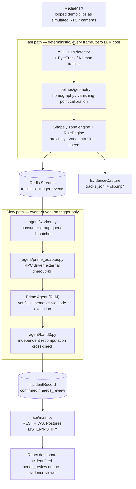

# SiteWatch AI — hybrid deterministic/probabilistic industrial safety intelligence

**Status: active development, no live deployment.** This is a local-stack portfolio
project — `make up` runs the full system (camera simulation, detection/tracking, rule
engine, agent, API, live dashboard) on your machine via Docker Compose; there is
no hosted demo URL and none is planned (ADR-004: documentation-only cloud deployment —
three fully-specified Terraform stacks for AWS/GCP/Azure exist, validate in CI, and are
realized down to real resources — Fargate/SQS/EFS/Aurora/S3, Cloud Run/Pub/Sub/Filestore/
Cloud SQL, Container Apps/Service Bus/Files/PostgreSQL — but none is applied to a live
account). **M0–M5 are closed; M6 (reference architecture & portfolio polish) is in
progress** — Terraform for all three clouds, `iac-check` CI, runbook review, and cost
model are done; the simulated-live replay demo mode and final README/ADR/diagram polish
are what's left. Live status: [docs/12-roadmap.md](docs/12-roadmap.md).

## What is this? (plain-language overview)

SiteWatch AI answers an operational question warehouses and construction sites actually
have: *is a worker about to be hit by a forklift, has someone entered an exclusion zone
too long, is a vehicle over the site speed limit — and when something ambiguous happens,
what actually occurred?* It watches simulated camera feeds (MP4 clips looped as RTSP),
detects and tracks people and vehicles, projects every detection onto a metric ground
plane, and evaluates deterministic spatial safety rules in real time. Only the anomalies
that pass those rules go to an LLM agent, which re-verifies the kinematics by executing
code against the raw tracklet data — not by re-describing what the fast path already
claimed — before anything is recorded as a confirmed incident.

The architectural idea — and the portfolio centerpiece — is the **dual-plane split**:

> Fast path (deterministic, ≤100ms/frame, zero LLM cost): decode → YOLO11 detect →
> ByteTrack → Kalman → homography → Shapely zone/rule engine → `TriggerEvent`.
> Slow path (event-driven, seconds): a containerized agent worker re-derives the claimed
> kinematics from the same raw data and either confirms the incident or flags it for
> human review — it never trusts the fast path's numbers without checking them.

The thing that makes it more than "YOLO plus an LLM wrapper":

- **A hard, machine-checked boundary between the two planes.** Every value that crosses
  from vision code to the agent is a Pydantic v2 schema (`pipelines/schemas/models.py`) —
  `TrackletFrame`, `TriggerEvent`, `KinematicsVerdict`, `IncidentRecord`. Calibration has
  a hard numeric gate (`rms_px ≤ 2.0`, docs/04 §3): a camera that fails it doesn't get
  approximate metric rules, it degrades to zone-only geofencing rather than silently
  reporting wrong distances.
- **A recomputation gate the agent cannot talk its way past (Band-3).** `agent/band3.py`
  independently recomputes min-distance/closing-velocity from the stored tracklet window
  using the same math the fast path used, and rejects the incident — `state=needs_review`,
  raw evidence retained, nothing silently dropped — if either the fast path's own claim or
  the agent's verified answer falls outside tolerance (docs/06 §3).
- **The agent's own budget flags turned out not to be enough, so the code doesn't trust
  them alone.** A real feasibility spike found `--autonomous-max-turns` did not stop a
  runaway task (9 turns / 130+s against a limit of 3) — `agent/prime_adapter.py`'s
  external wall-clock timeout, not the CLI flag, is what actually enforces the budget.
  That's the kind of finding this project is built to surface and document, not hide.
- **Real per-camera calibration, done honestly.** Both calibration methods (point-
  correspondence homography and single-view-metrology from vanishing points) are
  validated against real phone footage, not just synthetic fixtures — including catching
  and fixing two real bugs (a vanishing-point sign ambiguity, an overly strict rotation
  tolerance) that only showed up on noisy real-world data.

| | |
| --- | --- |
| Deployment | Local only, `docker compose up` (mediamtx + redis + postgres + api + ui + vision workers + agent) |
| Fast path | YOLO11s (Ultralytics) + ByteTrack, homography/vanishing-point calibration, Shapely zone engine, deterministic rule engine (proximity, zone-dwell, speed) |
| Slow path | [Prime Agent](https://github.com/PrimeIntellect-ai/prime-agent) — Prime Intellect's open-source [RLM](https://www.primeintellect.ai/blog/rlm) (Recursive Language Model) agent — driven headless over a JSON-lines RPC protocol; per-incident trajectory-verification prompt; Band-3 recomputation gate |
| Delivery plane | FastAPI REST + WS (`api/`), React dashboard (`ui/`) — live incident feed, needs_review queue with a working review action, KPI bar, evidence viewer (clip playback + tracks.jsonl), shift-report rendering; verified against the real running stack including the WS push through the exact proxy path a browser uses |
| Broker | Redis Streams, time-based retention (`XTRIM MINID`), consumer groups for crash-safe agent consumption |
| Schemas | Pydantic v2, single source of truth, JSON Schema exported for the dashboard |
| Benchmark (M1/M5) | YOLO11s @ 35 FPS single-stream 1080p, RTX A4500 (spike-00, clean boot); TensorRT FP16 export closed a real M1/M2 doc/reality gap — 34-57% single-stream speedup, and 3-stream FP16 clears the ≥25 FPS/stream floor (30.2 FPS min-stream) under idle-recovered conditions, 9.5-13.2 FPS/stream under sustained thermal load — both published, not just the best case (`docs/benchmarks.md`) |
| Agent eval (M5) | 30 hand-labeled incidents run against the real `prime-agent` CLI: **86.7% raw validation pass** (all 4 misses were one external timeout, not a capability failure — 100% once retested with the evidence-based recalibrated timeout), **82.1% classification agreement** — [docs/eval-m5-agent-slow-path.md](docs/eval-m5-agent-slow-path.md) |
| Reference cloud architecture (M6) | Real, validated Terraform for AWS (ECS Fargate/SQS/EFS/Aurora/S3), GCP (Cloud Run/Pub/Sub/Filestore/Cloud SQL), and Azure (Container Apps/Service Bus/Files/PostgreSQL) — `fmt`/`validate` green in CI (`iac-check.yaml`), never applied (ADR-004) |
| Tests | 149 total (122 passing offline, 27 integration tests gated on a real Postgres — green in CI, skip cleanly without one locally); a golden-session contract test replays a real captured agent RPC transcript so CI doesn't need the (currently non-public) `prime-agent` package |
| Honest scope | portfolio project; simulated camera feeds (looped demo clips, not live cameras); real per-camera calibration for the three named demo cameras is still open — only a personal-footage fixture has been calibrated end-to-end so far; video+boxes overlay/2D site canvas not built (needs `frame.ticker`, still unwired) |

## Architecture at a glance



Where things live:

| Path | What it is |
| --- | --- |
| `pipelines/ingestion/` | MP4→RTSP simulation config (MediaMTX), frame source |
| `pipelines/vision/` | `detector.py`, tracker, `rules.py` (the fast-path rule engine), `pipeline.py` (frame loop), `evidence.py` (trigger evidence capture) |
| `pipelines/geometry/` | `homography.py` (DLT point-correspondence), `vanishing_point.py` (single-view metrology), `calibrate.py` (CLI tool, both methods), `zones.py` |
| `pipelines/broker/` | Redis Streams retention (`XTRIM MINID`) + consumer-group hardening, replay tooling |
| `pipelines/schemas/` | Pydantic v2 single source of truth for everything crossing the fast/slow boundary |
| `agent/worker.py` | Queue dispatcher: pops `TriggerEvent`s, writes incident payload files, drives the agent, applies the Band-3 gate |
| `agent/prime_adapter.py` | The only module allowed to invoke `prime-agent`; external wall-clock timeout+kill on every prompt |
| `agent/band3.py` | Recomputation cross-check gate (docs/06 §3) |
| `agent/prompts/` | Per-incident prompt templates (trajectory verification, generic classification) |
| `evaluation/` | `build_seed_incidents.py` + `agent_eval.py` (the 30-fixture agent eval set/runner), `benchmark_models.py` (fast-path FPS/latency/VRAM, multi-stream + precision matrix), `eval_tracking.py` (MOTA/IDF1 against MOT17) |
| `api/` | FastAPI REST + WS, real Postgres-backed persistence (`repository.py`), evidence-serving endpoints, shift-report rendering (`reports.py`) |
| `ui/` | React dashboard — incident feed with live WS updates, needs_review queue + review form, KPI bar, evidence viewer |
| `deploy/terraform/` | Real, validated Terraform for AWS/GCP/Azure (`environments/{aws,gcp,azure}/`) — authored and `fmt`/`validate`-checked, never applied (ADR-004) |
| `config/` | `cameras.yaml`, `zones.yaml`, `rules.yaml` — the deterministic rule configuration |
| `docs/` | The full design suite: architecture, schemas, security, cost model, risk register, ADRs, spike reports, cloud deployment guides |
| `tests/` | 149 tests: schema round-trips, rule-engine known-answer tests, calibration math, broker hardening, agent/adapter plumbing against a scripted stand-in, the golden-session contract replay, and (integration, Postgres-gated) API/repository/persistence round-trips |
| `.github/workflows/` | `ci.yaml` (lint/type/test/schema-compat, Python + React), `contract-agent.yaml` (golden RPC replay), `iac-check.yaml` (`terraform validate` for all three clouds, never applied) |

## Quickstart

Requires Docker, [uv](https://docs.astral.sh/uv/) (Python 3.11+), and — only if you want
to run the real agent slow path, not just the fast path — a working local install of
[`prime-agent`](https://github.com/PrimeIntellect-ai/prime-agent) (not yet on the public
npm registry; see `docker/vendor/README.md` for the current vendoring workaround).

```bash
git clone https://github.com/PCSchmidt/sitework-ai
cd sitework-ai
uv sync
uv run pytest              # 122 offline tests; +27 more against a real Postgres

make up                    # docker compose up --build: full local stack,
                            # simulated camera feeds, live dashboard at :5173
make calib                 # launch the manual camera-calibration CLI
make agent-eval            # run the seeded incident set against the real prime-agent CLI
make tracking-eval         # MOTA/IDF1 against the MOT17 mirror
make eval                  # fast-path benchmark harness (single/multi-stream, FP32/FP16)
```

## Approach: why it is built this way

- **Deterministic first, LLM only on ambiguity.** Every safety-critical alert (proximity,
  zone dwell, speed) fires from documented, versioned geometric math — zero LLM cost, zero
  hallucination surface. The agent only ever runs on triggers the deterministic layer
  already raised, and re-derives its own answer from raw data rather than trusting the
  trigger's summary.
- **The gate is structural, not prompted.** `agent/band3.py` doesn't ask the model to
  double-check itself — it independently recomputes the same numbers from `tracks.jsonl`
  and compares both the fast path's claim and the agent's claim against that recompute.
  Either one drifting outside tolerance rejects the incident to `needs_review`.
- **Calibration has a hard numeric floor, and degrades honestly.** `rms_px ≤ 2.0` is not a
  suggestion — a camera that fails it keeps zone-intrusion detection (geometric
  containment tolerates imprecision) but proximity/speed rules that need real metric
  distance go inert rather than reporting a number nobody verified.
- **Real footage before real cameras.** Rather than guess at calibration math against
  synthetic data alone, both calibration methods were run against actual phone footage —
  which caught two real implementation bugs synthetic tests hadn't surfaced (see
  `docs/12-roadmap.md`'s M2 notes).
- **The agent's own safety rails were tested, not assumed.** A dedicated feasibility spike
  (`docs/spikes/spike-01-prime-agent-headless.md`) found a real gap in `prime-agent`'s own
  budget-enforcement flags and changed the design in response — external timeout
  ownership moved into `agent/prime_adapter.py` rather than staying a documentation
  assumption.
- **Everything that can be tested against the real system, is.** The M3 agent eval set
  runs against the actual `prime-agent` CLI (not a mock); the CI contract test replays a
  real captured RPC transcript rather than a synthetic one, because `prime-agent` isn't
  installable in CI yet (see Limitations).

## Motivation

Warehouse and construction-site safety systems either stop at "an alert fired" — no
verification, no audit trail, no explanation of what actually happened — or they route
everything through an LLM and inherit its unreliability for decisions that matter. This
project is a demonstration of the middle path: keep the safety-critical layer
deterministic and auditable, and use a reasoning agent only where judgment is genuinely
needed (was this really a near-miss? does the claimed kinematics hold up?) — with a
recomputation gate the agent cannot bypass no matter how confident it sounds.

**This is a portfolio project.** All camera feeds are looped demo clips, not live site
cameras; the cloud deployment story (ADR-004) is documentation-and-Terraform-only, never
applied to a live account.

## Method (what the pipeline actually does)

1. **Ingest.** MediaMTX loops pinned demo clips as RTSP streams, one per simulated camera
   (`config/cameras.yaml`).
2. **Detect and track.** YOLO11s detects people/vehicles per frame; ByteTrack + a Kalman
   filter maintain per-camera track identity and state.
3. **Project to the ground plane.** If a calibration exists for the camera
   (`pipelines/geometry/calibrate.py`, either point-correspondence or vanishing-point
   method), each track's bottom-center pixel is projected to `ground_point_m` through the
   homography; zone membership (`pipelines/geometry/zones.py`, Shapely) is computed
   whenever *any* calibration exists — metric velocity/speed only when it clears the hard
   RMS gate.
4. **Evaluate deterministic rules.** `pipelines/vision/rules.py`'s `RuleEngine` evaluates
   proximity (pairwise distance + duration + closing speed), zone_intrusion (dwell timer),
   and speed (instantaneous, zone-gated) rules with cooldown-based dedup, and emits a
   `TriggerEvent` on any rule condition holding for its configured threshold.
5. **Capture evidence.** `pipelines/vision/evidence.py` keeps a rolling buffer of recent
   `TrackletFrame`s and, on a trigger, writes the pre/post-trigger window to
   `tracks.jsonl` + `clip.mp4` — exactly the data the slow path re-verifies against.
6. **Dispatch to the agent.** `agent/worker.py` pops the `TriggerEvent` off a Redis
   consumer group (crash-safe: an unacked entry gets reclaimed, never silently dropped),
   writes the incident payload files, and drives one `prime-agent` RPC session with a
   role-specific prompt — pairwise-distance verification for proximity triggers, a
   simpler sanity-check prompt for zone/speed triggers.
7. **Verify, don't trust.** The agent must execute real code against `tracks.jsonl` to
   answer — no eyeballing, no estimating — and writes `result.json` (`KinematicsVerdict`
   schema). `agent/band3.py` independently recomputes the same numbers and rejects on
   mismatch against either the fast path's or the agent's claim.
8. **Record.** Pass → `IncidentRecord` with `state=confirmed`. Fail (schema-invalid,
   Band-3 mismatch, agent timeout/crash) → `state=needs_review`, `rejection_reason` set,
   raw evidence retained for a human reviewer — never a silently dropped or fabricated
   classification. `agent/persistence.py`'s `PostgresPersister` writes every
   `IncidentRecord` (confirmed or needs_review) plus its `agent_run` stats to Postgres via
   `api/repository.py`; a Postgres `LISTEN`/`NOTIFY` trigger pushes it to the dashboard's
   live incident feed over WebSocket in the same request cycle.

## Results

All numbers are reproducible from this repo:

- **M1 (fast-path benchmark):** YOLO11s clears the ≥25 FPS single-stream floor at 1080p
  (**35.0 FPS**, RTX A4500) — both a clean-boot number and a thermal-throttled number
  (15–17 FPS after 2 hours of contended GPU load) are recorded, because hiding the
  discrepancy would be dishonest and the throttling finding is itself useful for hardware
  sizing (`docs/benchmarks.md`).
- **M2 (spatial layer):** rule engine, evidence capture, and broker hardening validated
  by 94 tests at close, including real (not just synthetic) calibration data from actual
  phone footage — which caught two real bugs: a vanishing-point sign ambiguity and an
  overly-strict rotation tolerance that rejected valid noisy real-world line picks.
- **M3 (agent slow path), measured 2026-09-17:** 10 hand-designed incidents run against
  the real `prime-agent` 0.9.3 CLI — **10/10 validation pass, 9/9 classification
  agreement, p50 triage latency 75.6s, max 96.0s.** Full table:
  [docs/eval-m3-agent-slow-path.md](docs/eval-m3-agent-slow-path.md).
- **M4 (delivery plane), 2026-09-17:** real Postgres persistence, FastAPI REST+WS, React
  dashboard — verified against the actual running docker-compose stack, including a
  websockets client observing an `incident.created` push through the exact Vite proxy
  path (`/api`, `/live/ws`) a browser uses, while a raw Postgres `UPDATE` fired it.
- **M5 (evaluation & tuning), measured 2026-09-18:** eval set expanded 10 → 30 fixtures;
  raw validation pass 26/30 (86.7%), all 4 misses traced to one external timeout that
  completed correctly in 48-65s on retest, not a capability failure — timeout
  recalibrated (150s → 210s) on that evidence, not a guess. Classification agreement
  23/28 (82.1%), clears its 80% target. TensorRT FP16 benchmark matrix: 34-57%
  single-stream speedup; 3-stream min-stream FPS is 30.2 (idle-recovered GPU, clears the
  ≥25 FPS floor) vs. 9.5-13.2 (sustained thermal load, doesn't) — both published, since
  production sizing needs the worst case, not the best one. MOTA/IDF1 measured for real
  against MOT17 (0.16-0.46, honestly explained — a generic COCO detector isn't tuned for
  MOT17's crowd density). Full results:
  [docs/eval-m5-agent-slow-path.md](docs/eval-m5-agent-slow-path.md),
  [docs/benchmarks.md](docs/benchmarks.md).
- **M6 (reference architecture), in progress:** all three clouds' Terraform realized from
  the AWS PDF spec and the GCP/Azure deployment guides, `fmt`/`validate` green in CI.
  Three real bugs caught by actually running `terraform validate` against real provider
  schemas (not by inspection) — a dangling GCP service-account reference, an Azure
  resource name Azure itself rejects, a wrong Terraform argument name — all fixed in both
  the `.tf` files and the source docs. The main `ci` workflow itself was also found red
  since project inception (a pre-existing lint violation plus a broken pnpm workspace
  config neither ever used in practice) and fixed for real, confirmed via a live CI run.
- **149 tests** (122 passing offline + 27 Postgres-integration, `uv run pytest`), ruff and
  mypy clean repo-wide, `npm test`/`npm run build` clean — all verified green in CI, not
  just locally.

## Limitations

- **No live deployment, and none is planned as a hosted demo.** This is a local-stack
  project by design (ADR-004); three complete Terraform stacks (AWS/GCP/Azure) exist and
  validate in CI (`terraform fmt -check` + `validate`, never `apply`) as reference
  architecture, not a running service.
- **Real per-camera calibration for the three named demo cameras (dock/yard/warehouse) is
  still open.** Both calibration methods are validated end-to-end against real footage of
  a personal test fixture, not the actual demo camera angles — that's a genuine,
  unresolved gap, not a documentation nit.
- **`prime-agent` isn't installable in CI yet.** It isn't on the public npm registry
  (`"private": true` in its own `package.json`); `Dockerfile.agent` uses a vendored
  tarball as an interim (`docker/vendor/README.md`), and the CI contract test replays a
  real captured transcript rather than driving the live CLI. A private registry (GitHub
  Packages) with build-time auth is the real fix, still owed.
- **The agent eval set (n=30) is still synthetic, hand-built tracklet fixtures, not real
  camera footage.** It validates the agent/Band-3/schema pipeline end to end, not the
  fast path's detection/tracking accuracy against real clips (that's `docs/benchmarks.md`'s
  job) or real-world per-camera calibration (still open, above).
- **No video+boxes overlay or 2D site canvas in the dashboard.** The incident feed,
  needs_review queue, and evidence viewer (clip playback) are real and verified; a live
  view of current track positions needs `frame.ticker` (bridging Redis's per-camera
  tracklet streams to WS), which stays unwired — `docs/06`'s own §5 flags this.
- **PPE detection (helmet/vest) isn't built.** The schema has fields for it
  (`PPEState`); M5 closed without the fine-tuned classifier landing — genuinely
  deferred, not silently dropped, and not yet re-scoped to a specific milestone.
- **The M6 Terraform is real but the multi-cloud benchmark/cost picture leans on a single
  development GPU.** S2 (≥3 streams ≥25 FPS) is confirmed reachable (idle-recovered) but
  not guaranteed under continuous production load on this specific laptop-class card — see
  `docs/benchmarks.md`'s sustained-load numbers, and the explicit recommendation to size
  cloud deployments off those, not the best case.
- **Agent budget flags alone are not a trustworthy ceiling** — documented, not hidden:
  spike-01 found `--autonomous-max-turns` did not stop a runaway task, so
  `agent/prime_adapter.py`'s own external timeout is the real backstop, and any future
  agent-driving code in this repo needs the same discipline.

## Operational notes

### What actually runs where

| Component | Runs as | Notes |
| --- | --- | --- |
| `mediamtx` | Docker Compose service | Loops pinned demo clips as RTSP (simulated cameras) |
| `redis` | Docker Compose service | Streams broker: `tracklets:{camera}` (5 min retention), `trigger_events` (1 h retention, consumer groups) |
| `postgres` | Docker Compose service | Real schema (docs/06 §6): `incidents`, `reviews`, `agent_runs`, with a `NOTIFY`-emitting trigger the API listens on for the dashboard's live push |
| `vision-*` workers | Docker Compose service, one per camera, GPU passthrough | `pipelines.vision.pipeline`, YOLO11s + ByteTrack |
| `agent` | Docker Compose service | `docker/Dockerfile.agent` runs `agent.worker` as a standing consumer against Redis, persisting via `PostgresPersister`; verified running end to end inside the actual built image, not just on the host |
| `api` (FastAPI) | Docker Compose service | Real REST+WS surface (`GET/POST /api/v1/incidents[/review]`, `/api/v1/{cameras,zones,rules,kpis}`, `/live/ws`, evidence + shift-report endpoints) |
| `ui` | Docker Compose service | Vite dev server proxying `/api`, `/healthz`, `/live/ws` to `api` — the dashboard |

### Data and keys

| Variable | Purpose |
| --- | --- |
| `REDIS_URL` | broker connection (`pipelines/vision/pipeline.py`, `agent/worker.py`); defaults to `redis://localhost:6379` |
| `YOLO_WEIGHTS` | override the detector weights path; defaults to `yolo11s.pt` |
| `DATABASE_URL` | Postgres connection for `api/main.py` and `agent/persistence.py`'s `PostgresPersister`; defaults to the local docker-compose credentials |
| `WORKSPACE_ROOT` | shared volume the `agent` service writes evidence into and the `api` service serves read-only (`GET /api/v1/incidents/{id}/evidence/*`) |
| — | `prime-agent`'s own model/API auth (OpenRouter) is configured through its own persistent harness state (`~/.prime/`), not a `sitework-ai` environment variable |

No cloud credentials are used anywhere in this repo's runtime path — the Terraform in
`deploy/` is validated, never applied (ADR-004).

### Verify the claims (a reviewer's path)

```bash
uv run pytest -q                          # 122 tests offline; +27 with TEST_DATABASE_URL set
uv run ruff check . && uv run mypy        # lint + types, repo-wide
uv run python scripts/check_docs.py       # cross-doc consistency gate
uv run python -m evaluation.agent_eval    # re-run the 30-fixture seeded eval (needs prime-agent installed)
uv run python -m evaluation.eval_tracking # re-run MOTA/IDF1 against MOT17
make up                                   # full local stack, simulated feeds, dashboard at :5173
curl -s http://localhost:8000/healthz     # API liveness
curl -s http://localhost:8000/api/v1/kpis # real KPI query against Postgres
cd ui && npm ci && npm test && npm run build   # dashboard: install, test, build
cd deploy/terraform/environments/aws && terraform fmt -check && terraform validate  # x3 clouds
```

### Documentation map

| Doc | What it covers |
| --- | --- |
| [PLAN.md](PLAN.md) | The master plan: scope, milestones, success criteria |
| [docs/01](docs/01-vision-and-scope.md)–[06](docs/06-schemas-and-api.md) | Vision/scope, system architecture, hybrid design, data/models, agent orchestration, schemas+API |
| [docs/07-repo-layout.md](docs/07-repo-layout.md) | Repo layout, conventions, CI workflows, Makefile targets |
| [docs/08-security.md](docs/08-security.md) | Container hardening, secrets, prompt-injection posture |
| [docs/09-testing-and-evaluation.md](docs/09-testing-and-evaluation.md) | Test pyramid, known-answer tests, agent eval methodology |
| [docs/10-cost-model.md](docs/10-cost-model.md) | LLM spend mechanics, measured vs. estimated cost |
| [docs/11-risks.md](docs/11-risks.md) | Risk register with measured outcomes, not just guesses |
| [docs/12-roadmap.md](docs/12-roadmap.md) | Live milestone status — the actual source of truth for "what's done" |
| [docs/benchmarks.md](docs/benchmarks.md) | Fast-path FPS/latency/VRAM/MOTA/IDF1 numbers — M1 clean-boot baseline through the M5 precision × stream matrix (sustained-load and idle-recovered, both published) |
| [docs/eval-m3-agent-slow-path.md](docs/eval-m3-agent-slow-path.md) | M3 agent eval results (n=10), run against the real CLI |
| [docs/eval-m5-agent-slow-path.md](docs/eval-m5-agent-slow-path.md) | M5 agent eval results (n=30) + the timeout-recalibration retest that backs the 150s→210s change |
| [docs/prime-agent-feasibility.md](docs/prime-agent-feasibility.md) | The feasibility analysis behind embedding Prime Agent as a runtime component |
| [docs/spikes/](docs/spikes/) | Time-boxed de-risking spikes (GPU benchmark, forklift class, Prime Agent headless) with honest results |
| [docs/adr/](docs/adr/) | Architecture decision records |
| [docs/deployment/](docs/deployment/) | AWS/GCP/Azure reference deployment guides — real runbooks for the Terraform in `deploy/terraform/` (documentation-only, ADR-004) |

## Engineering context

The slow-path agent is a containerized deployment of **[Prime Agent](https://github.com/PrimeIntellect-ai/prime-agent)**, Prime Intellect's open-source agent built on their **[RLM](https://www.primeintellect.ai/blog/rlm) (Recursive Language Model)** idea: instead of stuffing everything into one model's context window, an RLM keeps its own reasoning lean and manages a persistent Python REPL plus recursive calls to sub-LLMs to do the heavy lifting — exactly the shape this project needed for an incident verifier that must *compute* an answer (execute code against the raw tracklet window) rather than *guess* one from a prompt. `agent/prime_adapter.py` is the only module in this repo allowed to invoke it, wrapped in an external timeout the feasibility spike showed was necessary regardless of the CLI's own budget flags — see [docs/prime-agent-feasibility.md](docs/prime-agent-feasibility.md) for the full verified-capability writeup and [docs/spikes/spike-01-prime-agent-headless.md](docs/spikes/spike-01-prime-agent-headless.md) for the honest results of actually running it headless.

## License

[MIT](LICENSE).

## Author

**Paul Christopher Schmidt** — [@PCSchmidt](https://github.com/PCSchmidt)
