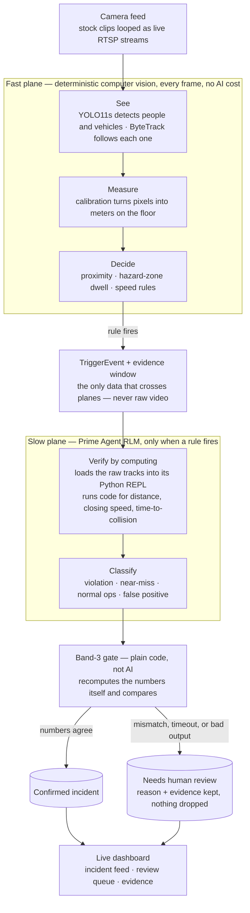
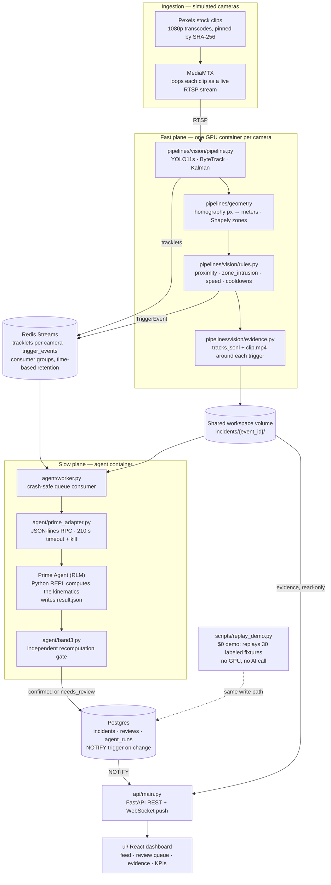

# SiteWatch AI — computer vision safety monitoring, verified by a Recursive Language Model

**Status: complete (milestones M0–M7), portfolio project.**
**▶ Live demo: [pcschmidt.github.io/sitework-ai](https://pcschmidt.github.io/sitework-ai/)**,
the real dashboard playing recorded pipeline output in your browser. The full system runs on your
own machine with Docker (see [Quickstart](#quickstart)). Build history and every known gap:
[docs/12-roadmap.md](docs/12-roadmap.md).


*The live demo page. Boxes, track IDs, zones, distances and rule firings are drawn frame by frame
from what the real pipeline recorded on each clip. The verdicts underneath come from real Prime
Agent runs that passed the Band-3 gate. Nothing on the page is simulated, but it is recorded:
a static page can't run a GPU or an LLM, so the live system stays a `make up` away.*

## What is this? (plain-language overview)

Warehouses and construction sites mix heavy machinery with people on foot. Most serious
accidents there come down to three situations: a forklift gets too close to a worker, someone
stands too long inside a hazard zone (like an excavator's swing radius), or a vehicle moves too
fast. SiteWatch AI is a prototype of software that watches ordinary security-camera video and
catches those situations automatically, then produces an auditable record of what actually
happened.

It does that in four steps:

1. **See.** A computer vision model finds every person and vehicle in each video frame and
   follows each one from frame to frame.
2. **Measure.** A one-time camera calibration converts positions on screen (pixels) into
   positions on the floor (meters), so "2.3 m apart" means 2.3 real meters.
3. **Decide.** Fixed, written-down safety rules check those measurements every frame: *forklift
   within 3 m of a person for 2 s*, *person in the swing zone for 3 s*, *vehicle over 2.2 m/s in
   the dock*.
4. **Verify.** When a rule fires, an AI agent re-checks the event by recomputing the distances
   and speeds from the raw tracking data, classifies it (violation, near-miss, normal operations,
   or false positive), and the result lands on a live dashboard.

**What's real and what's simulated.** There is no real site and no live camera. The "cameras"
are short stock video clips from [Pexels](https://www.pexels.com/), played on a loop so the
software sees them exactly as it would a live network camera. The computer vision, the
measurements, the rules, the AI verification, the database, and the dashboard are all real,
working code.

## The big idea: two planes, and a referee between them

Safety software usually picks one of two designs, and each has a serious flaw:

- **Pure rules** (classic computer vision + hand-set thresholds) are fast, cheap, and
  predictable, but they can't tell a genuine near-miss from a tracking glitch or harmless
  normal work, so they drown operators in false alarms.
- **Pure AI** (send the video or the data to a large language model and ask what happened) can
  reason about context, but it's slow, expensive to run on every frame, and can state numbers
  that sound confident and are simply wrong. That's unacceptable when the question is "how
  close did the forklift get?"

SiteWatch AI splits the work into **two planes** so each one does only what it's good at, and
puts a piece of plain code between them that neither can override.

| | Fast plane: deterministic computer vision | Slow plane: Prime Agent (Recursive Language Model) |
| --- | --- | --- |
| **Job** | watch every frame; measure; apply the safety rules | verify each rule firing and classify what happened |
| **Runs** | continuously, on every frame of every camera | only when a rule fires (rare) |
| **Speed** | milliseconds per frame | about a minute per incident |
| **Cost** | no AI cost at all | fractions of a cent per incident |
| **Nature** | *deterministic*: the same input always gives the same output | *probabilistic*: a language model, so its answers must be checked |
| **Built from** | YOLO11s, ByteTrack, a Kalman filter, homography, Shapely geometry | [Prime Agent](https://github.com/PrimeIntellect-ai/prime-agent), driven headless |

The only thing that crosses from one plane to the other is a small, strictly validated data
packet (a `TriggerEvent`) plus the few seconds of tracking data around it. The AI never sees raw
video.

### Why a Recursive Language Model for the slow plane

A normal LLM agent gets its data pasted into the conversation and answers in prose. Asked "how
close did track 42 get to track 77 across these 50 frames?", it has to read numbers off the page
and estimate, which is exactly where language models make things up.

[Prime Agent](https://github.com/PrimeIntellect-ai/prime-agent) is Prime Intellect's open-source
agent built on the **[Recursive Language Model (RLM)](https://www.primeintellect.ai/blog/rlm)**
idea. In their words, an RLM *"treats context as variables … and tools like recursive subagents
as function calls … inside a persistent REPL."* In plain terms: the model works inside a live Python
session. The data sits there as files and variables it can load, and the model's way of
answering is to write and run code, calling further model instances like functions when a
problem needs splitting up.

That is precisely the shape this verification job needs. SiteWatch gives the agent the trigger
and the raw tracking file, and instructs it to answer only from code it actually executes. So the
agent doesn't *say* the minimum distance was 0.7 m; it loads `tracks.jsonl`, computes the
distance between the two tracks in every frame, finds the minimum, and writes the result as JSON.
In the feasibility spike it did exactly that on every run, and twice it noticed on its own that
the fast plane's claimed distance didn't match its recomputation.

**Precisely what's used.** This project uses Prime Agent's persistent REPL (code-executed
verification), its headless JSON-lines RPC mode, and its per-session token accounting. One
verification role runs per incident. Prime Agent's other headline feature, the *Continual
Harness* (reusable sub-agent specs and memories that persist across sessions), and explicit
multi-agent orchestration were part of the original design but not built;
[docs/05](docs/05-agent-orchestration.md) spells out the difference.

### The referee: the Band-3 gate

Letting an AI compute the answer is better than letting it guess, but it still isn't proof. So
before anything is recorded, `agent/band3.py`, which is plain deterministic code, recomputes the
key numbers itself from the same tracking data. It checks both the fast plane's claim and the
agent's answer against its own recomputation (within 0.15 m for distance, 0.2 m/s for speed, or
5%). For zone-intrusion incidents it recomputes how long the person was continuously in the
zone and checks that the agent's verdict agrees with it.

- **Everything agrees** → the incident is stored as `confirmed`.
- **Anything disagrees**, or the agent times out, crashes, or writes malformed output → the
  incident is stored as `needs_review`, with the reason and all the evidence kept for a person to
  decide. Nothing is silently dropped, and the AI has no way to talk its way past the gate.

(The name comes from the design's three "bands": deterministic perception, probabilistic
reasoning, and deterministic gates on the reasoning's output.)


```mermaid
flowchart TD
    CAM["Camera feed<br>stock clips looped as live RTSP streams"]
    subgraph fast["Fast plane — deterministic computer vision, every frame, no AI cost"]
        DET["See<br>YOLO11s detects people and vehicles · ByteTrack follows each one"]
        GEO["Measure<br>calibration turns pixels into meters on the floor"]
        RULE["Decide<br>proximity · hazard-zone dwell · speed rules"]
    end
    TRIG["TriggerEvent + evidence window<br>the only data that crosses planes — never raw video"]
    subgraph slow["Slow plane — Prime Agent RLM, only when a rule fires"]
        RLM["Verify by computing<br>loads the raw tracks into its Python REPL<br>runs code for distance, closing speed, time-to-collision"]
        VERD["Classify<br>violation · near-miss · normal ops · false positive"]
    end
    GATE["Band-3 gate — plain code, not AI<br>recomputes the numbers itself and compares"]
    OK[("Confirmed incident")]
    HR[("Needs human review<br>reason + evidence kept, nothing dropped")]
    DASH["Live dashboard<br>incident feed · review queue · evidence"]

    CAM --> DET
    DET --> GEO
    GEO --> RULE
    RULE -->|rule fires| TRIG
    TRIG --> RLM
    RLM --> VERD
    VERD --> GATE
    GATE -->|numbers agree| OK
    GATE -->|mismatch, timeout, or bad output| HR
    OK --> DASH
    HR --> DASH
```

### What this gets you

- **The safety decision stays deterministic.** Whether a rule fires is decided by geometry and
  arithmetic, identically every time. The AI only works downstream of that decision, and a
  failed or wrong AI answer becomes a `needs_review` incident, never a lost one.
- **AI cost scales with incidents, not video.** The agent runs only on rule firings. Measured
  cost was about $0.002 per incident.
- **Every record can be audited.** A confirmed incident carries the verified numbers, the rule
  it broke, a written narrative, and links to the exact tracking data it was checked against.

## At a glance

| | |
| --- | --- |
| Live demo | [pcschmidt.github.io/sitework-ai](https://pcschmidt.github.io/sitework-ai/): the dashboard as a static GitHub Pages build, playing recorded pipeline output (3 cameras, 2 real agent-verified incidents) |
| Runs on | Your machine via Docker Compose. `make replay-up` needs only Docker; the full video pipeline also needs an NVIDIA GPU |
| Fast plane | YOLO11s (Ultralytics) + ByteTrack; three calibration methods (measured points, vanishing points, level camera) plus camera-motion compensation; Shapely zones; rule engine for proximity, zone dwell, and speed |
| Slow plane | [Prime Agent](https://github.com/PrimeIntellect-ai/prime-agent) v0.9.3 (RLM), headless over JSON-lines RPC, one fresh process per incident, 210 s external timeout |
| Verification | Band-3 recomputation gate; Pydantic v2 schemas on everything crossing the planes |
| Delivery | Postgres, FastAPI (REST + WebSocket), React dashboard: live incident feed, `needs_review` queue with a review form, KPI bar, camera player with a per-frame detection overlay and floor plan, shift report |
| Detection speed | YOLO11s 35 FPS single-stream at 1080p on an RTX A4500 laptop GPU; 3 streams reach 30.2 FPS each with TensorRT FP16 on a rested GPU, 9.5–13.2 under sustained heat ([benchmarks](docs/benchmarks.md)) |
| Agent accuracy | 30 hand-labeled incidents against the real Prime Agent: 86.7% first-pass (all misses were timeouts; 100% after recalibrating the timeout), 82.1% classification agreement ([eval](docs/eval-m5-agent-slow-path.md)) |
| Agent cost | ~43–56 K tokens and ~$0.002 per incident on a GLM-Flash-class model |
| Cloud | Validated Terraform for AWS, GCP, and Azure (`fmt`/`validate` in CI), deliberately never applied ([ADR-004](docs/adr/ADR-004-documentation-only-cloud-deployment.md)) |
| Tests | 182 Python (155 offline, 27 against a real Postgres in CI) + 6 dashboard unit tests |

## Architecture at a glance


```mermaid
flowchart TD
    subgraph ingest["Ingestion — simulated cameras"]
        CLIPS["Pexels stock clips<br>1080p transcodes, pinned by SHA-256"]
        MTX["MediaMTX<br>loops each clip as a live RTSP stream"]
    end
    subgraph fastplane["Fast plane — one GPU container per camera"]
        VIS["pipelines/vision/pipeline.py<br>YOLO11s · ByteTrack · Kalman"]
        GEOM["pipelines/geometry<br>homography px → meters · Shapely zones"]
        RULES["pipelines/vision/rules.py<br>proximity · zone_intrusion · speed · cooldowns"]
        EVID["pipelines/vision/evidence.py<br>tracks.jsonl + clip.mp4 around each trigger"]
    end
    REDIS[("Redis Streams<br>tracklets per camera · trigger_events<br>consumer groups, time-based retention")]
    VOL[("Shared workspace volume<br>incidents/{event_id}/")]
    subgraph slowplane["Slow plane — agent container"]
        WORK["agent/worker.py<br>crash-safe queue consumer"]
        ADAPT["agent/prime_adapter.py<br>JSON-lines RPC · 210 s timeout + kill"]
        PA["Prime Agent (RLM)<br>Python REPL computes the kinematics<br>writes result.json"]
        B3["agent/band3.py<br>independent recomputation gate"]
    end
    PG[("Postgres<br>incidents · reviews · agent_runs<br>NOTIFY trigger on change")]
    API["api/main.py<br>FastAPI REST + WebSocket push"]
    UI["ui/ React dashboard<br>feed · review queue · evidence · KPIs"]
    REPLAY["scripts/replay_demo.py<br>$0 demo: replays 30 labeled fixtures<br>no GPU, no AI call"]

    CLIPS --> MTX
    MTX -->|RTSP| VIS
    VIS --> GEOM
    GEOM --> RULES
    VIS -->|tracklets| REDIS
    RULES -->|TriggerEvent| REDIS
    RULES --> EVID
    EVID --> VOL
    REDIS --> WORK
    VOL --> WORK
    WORK --> ADAPT
    ADAPT --> PA
    PA --> B3
    B3 -->|confirmed or needs_review| PG
    PG -->|NOTIFY| API
    VOL -->|evidence, read-only| API
    API --> UI
    REPLAY -.->|same write path| PG
```

More diagrams (C4 context and container views, and step-by-step sequence diagrams for a real
incident and for replay mode): [docs/13-architecture-diagrams.md](docs/13-architecture-diagrams.md).

Where things live:

| Path | What it is |
| --- | --- |
| `pipelines/vision/` | `pipeline.py` (the per-camera frame loop), `detector.py`, `rules.py` (the rule engine), `evidence.py` (captures the tracking window around each trigger), `record.py` (runs the same loop offline over a clip and saves every frame's output for the dashboard's camera player) |
| `pipelines/geometry/` | `homography.py` (pixels → meters from measured points), `vanishing_point.py` (calibration from parallel lines), `level_camera.py` (calibration for a camera looking straight down an aisle), `motion.py` (camera-motion compensation for panning cameras), `calibrate.py` (CLI for all three), `zones.py` |
| `pipelines/broker/` | Redis Streams retention, consumer groups, replay tooling |
| `pipelines/schemas/` | Pydantic v2 models for everything crossing the planes: `TrackletFrame`, `TriggerEvent`, `KinematicsVerdict`, `IncidentRecord` |
| `agent/worker.py` | Pops each `TriggerEvent`, prepares the incident files, drives the agent, applies the gate, persists the result |
| `agent/prime_adapter.py` | The only module allowed to start `prime-agent`; enforces the external timeout |
| `agent/band3.py` | The recomputation gate |
| `agent/prompts/` | The per-incident prompts the agent receives |
| `api/` | FastAPI app, Postgres schema and queries, evidence endpoints, shift-report renderer |
| `ui/` | React + Vite dashboard; `ui/public/showcase/` holds the recorded clips and pipeline output the live demo plays |
| `config/` | `cameras.yaml`, `zones.yaml`, `rules.yaml`, `calibration/`: the whole deterministic rule setup |
| `evaluation/` | The 30-incident agent eval (fixtures + runner), the detection benchmark, MOTA/IDF1 tracking eval |
| `scripts/` | `replay_demo.py`, `showcase_agent.py` (real agent runs for the live demo's incidents), `smoke_test.py`, `record_golden_session.py`, `check_docs.py` |
| `docker/` | Dockerfiles, `docker-compose.yml` (full stack), `docker-compose.replay.yml` ($0 demo) |
| `deploy/terraform/` | AWS / GCP / Azure reference environments, validated, never applied |
| `data/manifests/` | Where every clip, dataset, and weight file came from, its license, and its hash |
| `docs/` | The design suite: architecture, schemas, security, cost, risks, ADRs, spikes, evals, runbooks |

## Quickstart

### 0. Just look (nothing to install)

Open the **[live demo](https://pcschmidt.github.io/sitework-ai/)**. The **Incidents** tab plays
each incident's clip cued a few seconds before its rule fires, then shows the fast plane's
measurement, the agent's verdict, and the gate's recheck side by side. The **Cameras** tab plays
every camera with the detection overlay. Hover a box for its floor position and speed, toggle
the layers, and watch the top-down floor plan. The page is a static build of the same React
dashboard; `make showcase` then `make showcase-agent` regenerate everything it plays.

### 1. See it running (Docker only, about 5 minutes the first time)

```bash
git clone https://github.com/PCSchmidt/sitework-ai
cd sitework-ai
make replay-up
```

Open **<http://localhost:5173>**. Incidents appear every 15 seconds and the counters climb. Click
**Needs review** to see incidents the gate rejected and why; click any `confirmed` incident for
its verified numbers and narrative. Stop it with `make replay-down` (or Ctrl+C).

No `make`? Run `docker compose -f docker/docker-compose.replay.yml up --build` instead. This
path was tested from a fresh clone on 2026-09-26.

### 2. Run the tests (Python 3.11+ and [uv](https://docs.astral.sh/uv/))

```bash
uv sync                # note: pulls CUDA-enabled PyTorch, a multi-GB download
uv run pytest          # 155 tests offline; 27 more run when TEST_DATABASE_URL points at Postgres
```

### 3. Run the full pipeline on video (NVIDIA GPU required)

The full stack runs the real detector on the looping clips and drives the real agent. It needs
setup a fresh clone doesn't have, because clips, weights, and the agent package aren't in git:

1. **GPU:** an NVIDIA GPU, with the NVIDIA Container Toolkit so Docker can use it.
2. **Demo clips:** download the three clips and make their 1080p versions, per
   [assets/clips/README.md](assets/clips/README.md).
3. **Detector weights:**
   `curl -L -o data/models/yolo11s.pt https://github.com/ultralytics/assets/releases/download/v8.3.0/yolo11s.pt`
   (the hash to check is in [data/manifests/yolo11-weights.yaml](data/manifests/yolo11-weights.yaml)).
4. **Prime Agent:** a working local install with a model provider configured in `~/.prime`, and
   its package vendored for the container, per [docker/vendor/README.md](docker/vendor/README.md).
   It isn't on the public npm registry.
5. `make up`, then open <http://localhost:5173>.

Two of the three demo cameras are calibrated (`config/calibration/`), so rules fire on their
clips: the 5 m exclusion rule on `dock_north_01` and the forklift-aisle zone rule on
`warehouse_aisle_01`. `yard_excavator_01` runs detection and tracking only (see
[Limitations](#limitations)).

Other entry points: `make calib` (camera calibration CLI), `make agent-eval` (the 30-incident
eval against the real agent), `make eval` (detection benchmark), `make tracking-eval` (MOTA/IDF1).

## Approach: why it is built this way

- **Deterministic first, AI only where judgment helps.** Every rule is documented, versioned
  geometry in `config/`. The agent only ever looks at events the rules already raised, and it has
  to re-derive its answer from raw data rather than trust the trigger's numbers.
- **The gate is structural, not a prompt.** Asking a model to "double-check itself" isn't a
  control. `agent/band3.py` recomputes independently and rejects on disagreement.
- **Calibration has a hard floor and fails safe.** A camera whose calibration error exceeds
  2.0 px keeps zone detection (containment tolerates small errors) but its distance and speed
  rules switch off rather than report numbers nobody can trust.
- **Tested against reality, not just synthetic data.** Both calibration methods were run on real
  phone footage, which exposed two bugs synthetic tests had missed. The agent was evaluated
  against the real Prime Agent CLI, not a mock.
- **The agent's own safety rails were tested, not assumed.** A feasibility spike found Prime
  Agent's `--autonomous-max-turns` flag didn't stop a runaway task (9 turns and 130+ s against a
  limit of 3). So the real limit lives in this repo's adapter as an external timeout and kill.
- **Negative results get published.** Benchmarks report the thermally throttled numbers next to
  the best case; the eval reports the raw 86.7% alongside the timeout-adjusted 100%.

## Motivation

Site-safety systems tend to fail in one of two ways. Some stop at "an alert fired", with no
verification, no audit trail, and no explanation. Others route everything through an LLM and
inherit its unreliability for decisions that matter. This project demonstrates a middle path:
keep the safety-critical layer deterministic and auditable, use a reasoning agent only where
judgment genuinely helps (was this really a near-miss?), make that agent compute rather than
assert, and put a recomputation gate behind it that it can't bypass.

It's also a working test of a specific question: can an RLM agent like Prime Agent run as a
headless, containerized *component* of an application, rather than as a chat assistant? The
answer from this build is yes, with named caveats
([spike-01](docs/spikes/spike-01-prime-agent-headless.md)).

## Method (what the pipeline actually does)

1. **Ingest.** MediaMTX loops each 1080p demo clip as an RTSP stream, one per simulated camera
   (`config/cameras.yaml`).
2. **Detect and track.** YOLO11s finds people and vehicles in each frame; ByteTrack plus a Kalman
   filter keep a stable identity and smoothed motion for each one. (Forklifts aren't a class in
   the model's training data, so trucks/buses stand in as "heavy vehicle"; see
   [spike-02](docs/spikes/spike-02-forklift-class.md).)
3. **Project to the floor.** For a calibrated camera, the bottom-center of each person's or
   vehicle's box is projected through the camera's homography to a floor position in meters.
   Zone membership is computed whenever *any* calibration exists; metric speed only when the
   calibration clears the 2.0 px error gate.
4. **Evaluate rules.** `RuleEngine` checks proximity (distance + duration + closing speed), zone
   dwell, and speed, with cooldowns so one situation doesn't fire repeatedly, and emits a
   `TriggerEvent` when a rule holds for its threshold.
5. **Capture evidence.** A rolling buffer writes the seconds before and after each trigger to
   `tracks.jsonl` and `clip.mp4`: exactly the data the slow plane re-checks.
6. **Dispatch.** `agent/worker.py` takes the trigger off a Redis consumer group (an entry a
   crashed worker never acknowledged is reclaimed, not lost), writes the incident files, and
   starts one Prime Agent session with the right prompt: pairwise-distance verification for
   proximity, a sanity check for zone and speed triggers.
7. **Verify by computing.** The agent runs Python against `tracks.jsonl` and writes
   `result.json`. The worker validates it against the `KinematicsVerdict` schema, then Band-3
   recomputes and compares.
8. **Record and push.** Pass → `confirmed`; anything else → `needs_review` with a reason. Either
   way the `IncidentRecord` and its token/turn stats go to Postgres, and a `NOTIFY` trigger pushes
   it to the dashboard over WebSocket.

## Results

All reproducible from this repo; see [Verify the claims](#verify-the-claims-a-reviewers-path).

- **Detection speed:** YOLO11s runs at 35.0 FPS single-stream on 1080p video (RTX A4500 laptop
  GPU). Native 4K decoding, not the model, was the bottleneck, so the clips are served at 1080p.
  TensorRT FP16 added 34–57% single-stream. Three simultaneous streams reached 30.2 FPS each on a
  rested GPU but 9.5–13.2 under sustained thermal load; both are published, because production
  sizing needs the worst case ([docs/benchmarks.md](docs/benchmarks.md)).
- **Agent verification:** against the real Prime Agent CLI, 10/10 incidents passed at M3; on the
  expanded 30-incident set at M5, 26/30 passed first time (86.7%). All four misses were the same
  150 s timeout, and all four completed correctly in 48–65 s on retest, so the timeout was raised
  to 210 s on that evidence. Classification agreement with the hand labels was 82.1% (96.4%
  timeout-adjusted); the one real disagreement traced to a fixture-labeling issue.
  Median verification time: 68.8 s ([eval](docs/eval-m5-agent-slow-path.md)).
- **Tracking accuracy:** MOTA 0.16–0.46 on MOT17 pedestrian sequences. That's low, and expected
  for an off-the-shelf detector on crowded street scenes it wasn't tuned for; it's reported as a
  baseline, not a claim of tracking quality on site footage.
- **The live demo's incidents (M7):** the full chain ran on real clips. Detection, tracking,
  calibration and rules ran on every frame, then real Prime Agent sessions and the gate ran on
  each trigger. The dock warning fired at 4.20 m (5 m rule); the agent recomputed 4.20 m and
  classified it normal operations. The aisle intrusion fired after 3.0 s in the zone; the agent
  confirmed a violation. On its **first** run, though, the agent called that intrusion a false
  positive despite about 8 s of in-zone evidence, and the gate had no zone check to catch it.
  That gap is now closed (see [the gate](#the-referee-the-band-3-gate)). Building the demo also
  surfaced three real fast-plane bugs, all fixed with tests: cooldowns shared across rules of the
  same kind (so a warning could mute a tighter rule), speed limits applied to pedestrians, and
  jittery 0.1 s speed estimates ([docs/12 M7](docs/12-roadmap.md)).
- **Calibration:** the first two methods validated on real phone footage, catching two bugs (a sign
  ambiguity in the vanishing-point math, and a rotation tolerance too strict for real-world line
  picks). A later cross-platform CI failure exposed that the sign fix was itself incomplete, and
  the corrected version resolves it with a real margin rather than a floating-point coin flip.
- **Cloud:** all three Terraform environments validate. Running `terraform validate` for real
  caught three bugs in the source specs (a dangling reference, a name Azure rejects, a wrong
  argument name), fixed in both the code and the runbooks.
- **Quality gates:** 182 Python tests (155 offline + 27 Postgres) and 6 dashboard tests; ruff,
  mypy, UI type-check and build clean, all green in CI.

## Limitations

- **Simulated inputs only.** The cameras are looped stock clips, and the agent eval set is 30
  hand-built tracking scenarios, not real incidents.
- **The demo calibrations are estimates, not surveys.** Stock footage has no measured points.
  `dock_north_01`'s scale comes from a forklift's published wheel track and a person's typical
  height (about ±8% on every distance), plus an assumed focal length that affects distances along
  the aisle. `warehouse_aisle_01` has nothing measurable, so its calibration deliberately fails
  the quality gate and it runs zone rules only. Every assumption is written into the calibration
  files and shown on the dashboard.
- **The demo's 5 m rule is a choice.** On the dock clip the worker never comes within the 3 m
  forklift rule (closest approach 4.2 m), so the demo site adds a conservative 5 m warning tier.
  The agent then correctly verifies that the event was normal operations. No clip contains a
  genuine close call.
- **The detector has blind spots.** It is COCO-trained, so it has no forklift class (trucks stand
  in as "heavy vehicle") and no excavator class: on the yard clip only the cab operator is boxed.
- **The agent is nondeterministic.** The same aisle incident got `false_positive` once and
  `violation` twice. The gate now catches that particular contradiction for zone rules, but a
  plausible wrong judgment inside the allowed classes (e.g. normal ops vs near miss) still passes.
- **No alarm output.** Rules fire in milliseconds, but nothing sounds an alarm off them. A person
  sees an incident on the dashboard only after the ~1-minute agent verification. A consumer on
  the `trigger_events` stream is the missing piece ([docs/02 §3](docs/02-system-architecture.md)).
- **Prime Agent is used narrowly.** One verification role per incident, using the REPL and RPC
  mode. The designed compliance auditor, shift synthesizer, model-tier routing, scheduling, and
  Continual Harness sub-agent specs were not built ([docs/05](docs/05-agent-orchestration.md)).
- **Not reproducible everywhere yet.** `prime-agent` isn't on npm, so the agent container builds
  only from a vendored package; CI checks the agent integration by replaying a recorded session
  instead. The full stack also needs the clips and weights downloaded by hand.
- **The video overlay is recorded, not live.** The camera player draws recorded pipeline output;
  the running stack doesn't stream tracks to the browser (`frame.ticker` wasn't built). PPE
  (hard hat / vest) detection was never built either.
- **Local-demo security only.** The API has no authentication, and the compose files expose the
  API and dashboard ports on all network interfaces. Fine on a private machine; not fine on a
  shared network ([docs/08](docs/08-security.md)).
- **Thin dashboard tests.** Six unit tests cover the overlay's frame lookup and geometry; there
  are no component or end-to-end tests in CI, and there's no prompt-injection test suite.
- **One development GPU.** All performance numbers come from a single laptop-class GPU.

## Operational notes

### What runs where

| Component | Runs as | Notes |
| --- | --- | --- |
| `mediamtx` | full stack | Loops the demo clips as RTSP (ports 8554, 8889) |
| `vision-*` | full stack, one per camera, GPU | Detector + tracker + rules; writes evidence to the shared workspace |
| `redis` | full stack | Streams broker; not published to the host |
| `agent` | full stack | Prime Agent worker; mounts `~/.prime` for model auth |
| `postgres` | both stacks | `incidents`, `reviews`, `agent_runs`; not published to the host |
| `api` | both stacks | FastAPI on port 8000; creates the schema on startup |
| `ui` | both stacks | Vite dev server on port 5173, proxying `/api` and `/live/ws` to the API |
| `replay` | replay stack only | Replays the 30 fixtures into Postgres; replaces `mediamtx`, `vision-*`, and `agent` |

### Data and keys

| Variable | Purpose |
| --- | --- |
| `DATABASE_URL` | Postgres for the API and the agent's persister (defaults to the local compose credentials) |
| `REDIS_URL` | broker connection for the vision workers and agent |
| `YOLO_WEIGHTS` | detector weights path (container default `/models/yolo11s.pt`) |
| `EVIDENCE_ROOT` / `WORKSPACE_ROOT` | the shared evidence folder the vision workers write, the agent reads, and the API serves |
| `PRIME_HARNESS_DIR` | host folder mounted as the agent's `~/.prime` (defaults to `~/.prime`) |
| `TEST_DATABASE_URL` | enables the 27 Postgres integration tests |

The model provider key (OpenRouter in the evals) lives in Prime Agent's own `~/.prime`
configuration, not in this repo. No cloud credentials are used anywhere: the Terraform is
validated, never applied.

### Verify the claims (a reviewer's path)

```bash
uv run pytest -q                          # 155 offline; 182 with TEST_DATABASE_URL set
uv run ruff check . && uv run mypy        # lint + types
uv run python scripts/check_docs.py       # cross-document consistency checks
make replay-up                            # the dashboard at http://localhost:5173
curl -s http://localhost:8000/api/v1/kpis # live counts from Postgres
(cd ui && npm ci && npm test && npm run build)  # dashboard tests, type-check + build
make showcase && make showcase-agent      # re-record the live demo (GPU + prime-agent)
make iac                                  # terraform fmt + validate, all three clouds (needs terraform)
make agent-eval                           # the 30-incident eval (needs prime-agent installed)
make tracking-eval                        # MOTA/IDF1 (needs the MOT17 download)
```

### Documentation map

| Doc | What it covers |
| --- | --- |
| [PLAN.md](PLAN.md) | The master plan, success criteria S1–S6 with their final status, milestone summary |
| [docs/01-vision-and-scope.md](docs/01-vision-and-scope.md) | The problem, personas, and original scope (with a vision-vs-built note) |
| [docs/02-system-architecture.md](docs/02-system-architecture.md) | Components, latency budget, failure modes, implementation status |
| [docs/03-hybrid-design.md](docs/03-hybrid-design.md) | The three bands: deterministic perception, probabilistic reasoning, deterministic gates |
| [docs/04-data-and-models.md](docs/04-data-and-models.md) | Datasets, model choice, calibration, the benchmark matrix |
| [docs/05-agent-orchestration.md](docs/05-agent-orchestration.md) | Agent roles as designed vs. as built |
| [docs/06-schemas-and-api.md](docs/06-schemas-and-api.md) | Data contracts, the Band-3 tolerances, the real API and database schema |
| [docs/07-repo-layout.md](docs/07-repo-layout.md) | Repository tree, conventions, CI, Make targets |
| [docs/08-security.md](docs/08-security.md) | Threat model, with an implemented-vs-designed status per control |
| [docs/09-testing-and-evaluation.md](docs/09-testing-and-evaluation.md) | Test pyramid, agent-eval method and metrics, known coverage gaps |
| [docs/10-cost-model.md](docs/10-cost-model.md) | LLM spend (measured vs. estimated), demo hosting, cloud bill of materials |
| [docs/11-risks.md](docs/11-risks.md) | Risk register with outcomes |
| [docs/12-roadmap.md](docs/12-roadmap.md) | Milestone-by-milestone history — the source of truth for what's done |
| [docs/13-architecture-diagrams.md](docs/13-architecture-diagrams.md) | C4 and sequence diagrams of what actually runs |
| [docs/benchmarks.md](docs/benchmarks.md) | Detection speed and tracking accuracy numbers |
| [docs/eval-m3-agent-slow-path.md](docs/eval-m3-agent-slow-path.md) / [eval-m5](docs/eval-m5-agent-slow-path.md) | Agent eval results (n=10, n=30) |
| [docs/prime-agent-feasibility.md](docs/prime-agent-feasibility.md) | Can an RLM agent be an application component? The analysis, and how it turned out |
| [docs/spikes/](docs/spikes/) | Time-boxed experiments: GPU benchmark, forklift class, Prime Agent headless |
| [docs/adr/](docs/adr/) | Architecture decision records |
| [docs/deployment/](docs/deployment/) | AWS / GCP / Azure runbooks for the Terraform |

## Glossary

| Term | Meaning |
| --- | --- |
| **Deterministic** | Always produces the same output for the same input: plain math and rules, no randomness or AI judgment |
| **Detection / bounding box** | The model finding an object in a frame and drawing a rectangle around it |
| **Tracking / track** | Linking detections across frames so "person #42" stays person #42 as they move |
| **Tracklet** | A short stretch of one track; `TrackletFrame` is one snapshot of all tracks from one camera |
| **Calibration / homography** | The mapping from camera pixels to floor positions in meters, solved from known reference points or lines |
| **RTSP** | The streaming protocol network cameras use; MediaMTX fakes it here with looping files |
| **TriggerEvent** | The packet the fast plane emits when a rule fires: rule, camera, tracks involved, measured values |
| **RLM (Recursive Language Model)** | A language model that works inside a live Python session, treating its inputs as data to compute on and calling sub-models like functions |
| **REPL** | An interactive code session (here, Python) the agent runs code in |
| **Band-3 gate** | The deterministic check that recomputes the agent's numbers before anything is recorded |
| **`needs_review`** | The state for an incident the gate couldn't confirm; it waits for a human decision |
| **TensorRT / FP16** | NVIDIA's inference optimizer, and the half-precision number format that makes the model faster |
| **MOTA / IDF1** | Standard scores for how accurately a tracker follows people across frames |

## License

This repository's code is [MIT](LICENSE). The full video pipeline depends on
[Ultralytics](https://github.com/ultralytics/ultralytics) and its YOLO11 weights, which are
**AGPL-3.0**, so that combination carries AGPL obligations; any commercial or hosted-service
use would need an Ultralytics Enterprise license or a different detector
([data/manifests/yolo11-weights.yaml](data/manifests/yolo11-weights.yaml)). Demo clips are
under the Pexels License, and datasets under their own terms (see `data/manifests/`).

## Author

**Paul Christopher Schmidt** — [@PCSchmidt](https://github.com/PCSchmidt)

The codebase was built with the help of [Claude Code](https://claude.com/claude-code). Prime
Agent is a runtime component of the application, not the tool that built it.
