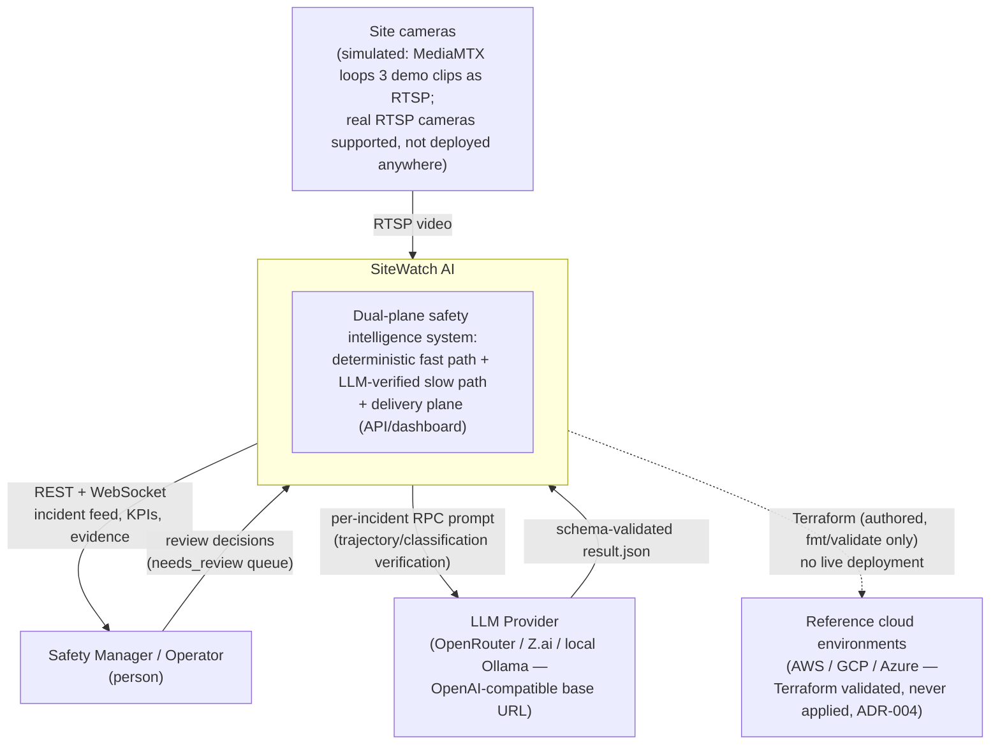
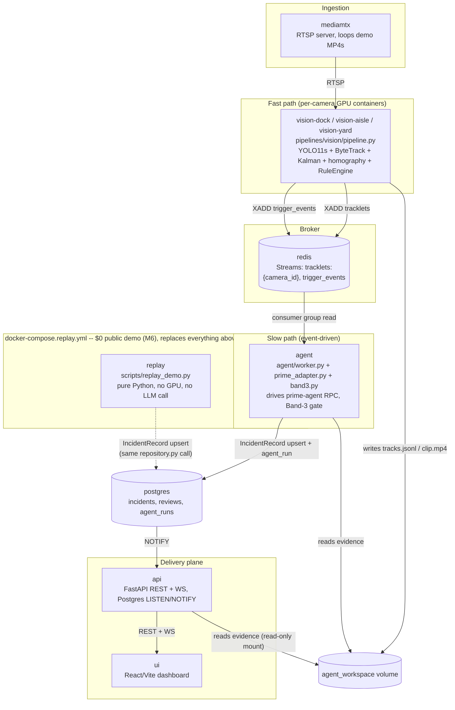
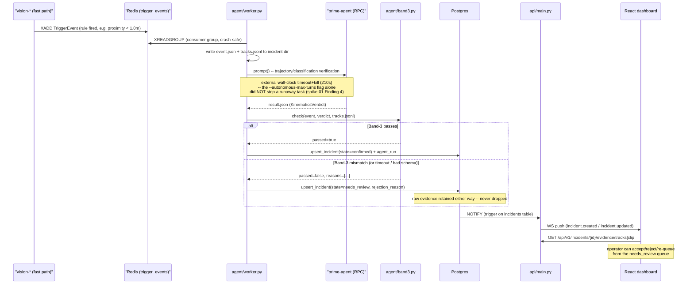

# 13 — Architecture Diagrams (C4 + sequence)

These diagrams describe the system **as actually built and verified**, not the original design
aspiration — where the two differ (video overlay/2D canvas, Shift Synthesizer, PPE/forklift
fine-tunes), that's called out inline rather than drawn as if it exists. See
`docs/02-system-architecture.md` §1's "Implementation status" note for the full list. Complements
the flowchart in the [README](../README.md#architecture-at-a-glance), which shows the same fast/slow
path split at module granularity; this doc adds the C4 levels above it and the sequence below it.

## C4 Level 1 — System Context

Who and what SiteWatch AI talks to, with no internals shown.



## C4 Level 2 — Containers

The real `docker-compose.yml` services (local, $0), plus the parallel `docker-compose.replay.yml`
stack (also $0) that substitutes for the GPU/LLM containers when the only goal is a live-looking
public demo (docs/12-roadmap.md M6).



## Sequence — real incident (confirmed and needs_review paths)

The actual `agent/worker.py` flow (docs/05 §3), including the Band-3 rejection branch that's a
first-class outcome, not an error case.



## Sequence — replay mode ($0 public demo, M6)

The same Postgres → API → WS → dashboard path, entered without a GPU vision container or an LLM
call anywhere in the loop.

```mermaid
sequenceDiagram
    participant F as "evaluation/fixtures/incidents/* (30 hand-labeled M5 fixtures)"
    participant RP as scripts/replay_demo.py
    participant PG as Postgres
    participant API as api/main.py
    participant UI as React dashboard

    loop every --interval-s (default 8s), cycling through fixtures
        RP->>F: load event.json + tracks.jsonl + expected.json
        RP->>RP: stage_evidence() -- copy tracks.jsonl to workspace/incidents/{replay_id}/
        alt proximity fixture (2 involved tracks)
            RP->>RP: agent.band3.recompute_kinematics(tracks) -- real recomputation,<br>same math the Band-3 gate itself uses
        end
        RP->>RP: build_record() -- classification/state from expected.json<br>(the fixture's own hand-labeled ground truth);<br>narrative_md tagged [REPLAY DEMO];<br>agent_run = 0 tokens, model="replay-mode (no LLM call)"
        RP->>PG: upsert_incident() (same repository.py call a real incident uses)
    end
    PG->>API: NOTIFY
    API->>UI: WS push (incident.created)
    UI->>API: GET /api/v1/incidents/{id}/evidence/tracks
```

## What these diagrams deliberately don't show

- **Video + boxes overlay / 2D site canvas** — not built (needs `frame.ticker`, live track
  positions over WS, still unwired per `docs/02-system-architecture.md` §1). The dashboard's real
  live surface today is the incident feed, needs_review queue, KPI bar, and evidence viewer.
- **Shift Synthesizer sub-agent** — not built. `api/reports.py` (shown nowhere above, since it's a
  pure-function HTML renderer, not a message in this flow) stitches together each incident's own
  already-written `narrative_md` for a time window; it is not a new scheduled agent invocation.
- **A live/hosted instance of any of this** — none exists. `docker-compose.replay.yml` describes a
  stack anyone can run locally at $0; it is not itself a public URL.
